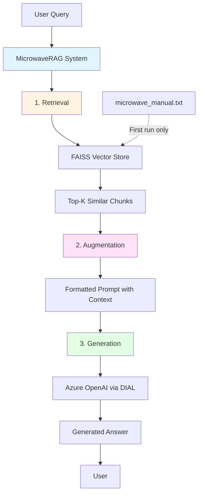

# AI DIAL RAG Overview - Documentation Hub

Welcome to the documentation for the AI DIAL RAG Overview project—a learning-focused implementation of a Retrieval-Augmented Generation (RAG) system for microwave manual assistance.

## 🎯 Project Purpose

This project is an **educational implementation** demonstrating how to build a complete RAG pipeline from scratch. Students learn to:
- Implement document retrieval using vector embeddings
- Augment prompts with contextual information
- Generate accurate answers using Large Language Models (LLMs)

**Domain**: Microwave appliance technical support  
**Target Users**: Python developers learning RAG concepts  
**Tech Stack**: Python 3.11+, LangChain, FAISS, Azure OpenAI via DIAL API

## 📚 Documentation Overview

| Document | Purpose |
|----------|---------|
| [Architecture](./architecture.md) | System design, components, data flow, and architectural decisions |
| [Setup Guide](./setup.md) | Environment setup, dependency installation, and configuration |
| [API Reference](./api.md) | Public interfaces, classes, methods, and usage examples |
| [Testing Guide](./testing.md) | Test strategy, sample queries, and validation approaches |
| [Traceability Matrix](./traceability-matrix.md) | Feature-to-code-to-test mapping for complete coverage visibility |
| [Glossary](./glossary.md) | Domain terms, abbreviations, and technical concepts |
| [ADRs](./adr/) | Architectural Decision Records documenting key design choices |
| [Roadmap](./roadmap.md) | Future enhancements and learning milestones |
| [Changelog](./changelog.md) | Notable changes and version history |

## 🚀 Quick Start

```bash
# 1. Install dependencies
pip install -r requirements.txt

# 2. Set API key (requires EPAM VPN)
export DIAL_API_KEY="your-key-here"

# 3. Run the RAG assistant
python -m task.app
```

**First Run**: The system will automatically create a FAISS vector index from the microwave manual (takes ~30 seconds).

## 🏗️ High-Level Architecture



## 📖 Core Concepts

### Retrieval-Augmented Generation (RAG)
RAG combines information retrieval with text generation. Instead of relying solely on an LLM's training data, the system:
1. **Retrieves** relevant documents from a knowledge base
2. **Augments** the user's query with this context
3. **Generates** an informed answer using an LLM

### Three-Stage Pipeline
1. **Retrieval**: FAISS similarity search finds relevant manual chunks
2. **Augmentation**: User query + retrieved context → structured prompt
3. **Generation**: Azure OpenAI generates answer from augmented prompt

## 🎓 Learning Path

1. **Start here**: Read [Setup Guide](./setup.md) to get running
2. **Understand design**: Study [Architecture](./architecture.md)
3. **Explore code**: Review [API Reference](./api.md)
4. **Test knowledge**: Try queries from [Testing Guide](./testing.md)
5. **Dig deeper**: Read [ADRs](./adr/) for design rationale

## 📂 Repository Structure

```
ai-dial-rag-overview/
├── docs/                          # This documentation
├── task/                          # Main application code
│   ├── app.py                     # RAG pipeline implementation
│   ├── _constants.py              # Configuration (API keys, URLs)
│   └── microwave_manual.txt       # Knowledge base document
├── microwave_faiss_index/         # Persisted FAISS vector index
│   └── index.faiss                # Binary index file
├── requirements.txt               # Python dependencies
└── README.md                      # Project overview
```

## 🔗 Key Resources

- **DIAL API**: [https://ai-proxy.lab.epam.com](https://ai-proxy.lab.epam.com)
- **LangChain Docs**: [https://python.langchain.com](https://python.langchain.com)
- **FAISS Wiki**: [https://github.com/facebookresearch/faiss/wiki](https://github.com/facebookresearch/faiss/wiki)
- **Azure OpenAI**: [https://learn.microsoft.com/azure/ai-services/openai/](https://learn.microsoft.com/azure/ai-services/openai/)

## 🆘 Getting Help

- **Setup issues**: See [Setup Guide](./setup.md) troubleshooting section
- **Understanding architecture**: Review [Architecture](./architecture.md) diagrams
- **API usage**: Check [API Reference](./api.md) examples
- **Invalid results**: Consult [Testing Guide](./testing.md) for proper query formats

## 🤝 Contributing

This is an educational project. Contributions should:
- Maintain clarity for learning purposes
- Include documentation updates
- Add tests for new features
- Follow existing code patterns

## 📄 License

TODO: Add license information

---

**Last Updated**: 2025-12-30  
**Maintainer**: EPAM AI/ML Team  
**Contact**: TODO: Add contact information
