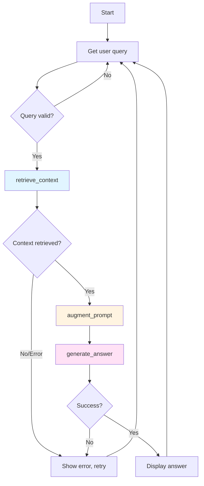

# ADR-004: Synchronous Pipeline Design

## Status
**Accepted** (2025-12-30)

## Context

The RAG system must orchestrate three sequential stages:
1. **Retrieval**: Search for relevant document chunks
2. **Augmentation**: Format prompt with retrieved context
3. **Generation**: Call LLM to produce answer

Key considerations for pipeline design:
- **Latency**: Total query-to-answer time (target: <5 seconds user-facing)
- **Complexity**: Code should be understandable for learning project
- **Error handling**: How to manage failures in each stage
- **Scalability**: Future support for concurrent requests
- **Resource efficiency**: LLM API rate limits and concurrent request limits

### Requirements
- Pipeline must be easy to understand and debug (educational project)
- Each stage should be independently testable
- Errors in one stage should not crash entire application
- Total latency acceptable for interactive CLI tool

### Constraints
- Single-process Python application (no distributed architecture)
- Students learning RAG concepts (not advanced async patterns)
- LangChain framework constraints (synchronous-first design)
- Limited concurrency (DIAL API likely has rate limits)

## Decision

**Implement a synchronous, sequential pipeline with clear stage separation.**

### Implementation

```python
class MicrowaveRAG:
    def main(self, rag: MicrowaveRAG):
        while True:
            user_question = input("\n> ").strip()
            
            # Stage 1: Retrieval (blocking, ~100-500ms)
            context = rag.retrieve_context(user_question)
            
            # Stage 2: Augmentation (blocking, <1ms)
            augmented_prompt = rag.augment_prompt(user_question, context)
            
            # Stage 3: Generation (blocking, ~2-5s)
            answer = rag.generate_answer(augmented_prompt)
            
            print(f"\nAnswer: {answer}")
```

### Stage Breakdown

| Stage | Operation | Latency | I/O Type |
|-------|-----------|---------|----------|
| Retrieval | Embed query + similarity search | 100-500ms | DIAL API (embeddings) |
| Augmentation | String formatting | <1ms | Memory |
| Generation | LLM inference | 2-5s | DIAL API (chat) |
| **Total** | All stages | ~2.6-5.5s | Network I/O bound |

### Synchronous Design Pattern



## Consequences

### Positive
- **Simplicity**: Sequential execution easy to understand and debug
- **Educational clarity**: Perfect for learning RAG pipeline steps
- **Predictable behavior**: Synchronous means predictable execution order
- **No concurrency bugs**: Avoids race conditions, deadlocks
- **LangChain native**: Framework designed for synchronous operations
- **Debugging friendly**: Stack traces are readable, breakpoints work cleanly
- **Error handling**: Clear where errors occur (which stage failed)

### Negative
- **Blocking**: User must wait for full pipeline (can't process requests in parallel)
- **Single request at a time**: No concurrent users in interactive mode
- **Not production-scalable**: Wouldn't handle multiple users efficiently
- **Resource underutilization**: While LLM responds (5s), system idle
- **Latency visible**: User sees full end-to-end delay

### Neutral
- **CLI context**: Fine for interactive terminal application
- **Rate limiting**: DIAL API rate limits not exploited by design
- **Request queuing**: N/A (no concurrent requests)

## Alternatives Considered

### 1. Asynchronous (Async/Await) Pipeline

**Implementation**:
```python
import asyncio

async def main_async(rag):
    while True:
        user_question = input("\n> ").strip()
        
        # Run stages concurrently where possible
        context, _ = await asyncio.gather(
            rag.retrieve_context_async(user_question),
            some_other_task()  # Hypothetical parallel task
        )
        
        augmented_prompt = rag.augment_prompt(user_question, context)
        answer = await rag.generate_answer_async(augmented_prompt)
        
        print(f"\nAnswer: {answer}")
```

**Pros**:
- Non-blocking: UI remains responsive
- Potential for concurrent API calls (if multiple users)
- Modern Python best practice (asyncio standard)

**Cons**:
- **Significant complexity**: Requires async/await throughout codebase
- **LangChain support**: Limited async support in LangChain core
- **Debugging difficulty**: Async stack traces harder to read
- **Overkill for CLI**: Single-user interactive tool doesn't benefit
- **Learning distraction**: Students focus on async patterns, not RAG concepts
- **DIAL API compatibility**: Unknown if DIAL API has async client

**Verdict**: Rejected (unnecessary complexity for single-user CLI)

---

### 2. Parallel Stages (Experimental)

**Idea**: Process multiple queries in parallel (multiple CLI threads)

```python
import concurrent.futures

executor = concurrent.futures.ThreadPoolExecutor(max_workers=4)

def process_query(rag, query):
    context = rag.retrieve_context(query)
    augmented = rag.augment_prompt(query, context)
    return rag.generate_answer(augmented)

# Multi-threaded queue processing
query_queue = queue.Queue()
for query in query_queue:
    future = executor.submit(process_query, rag, query)
```

**Pros**:
- Can process multiple queries concurrently
- Improves throughput if multiple users

**Cons**:
- **Unnecessary for CLI**: Single user enters one query at a time
- **State management**: FAISS index thread-safety concerns
- **Debugging complexity**: Race conditions possible
- **Not educational**: Distracts from RAG learning objective
- **No upside for current use case**: Doesn't improve user experience

**Verdict**: Rejected (doesn't match use case)

---

### 3. Message Queue / Event-Driven

**Architecture**: Decouple stages using message queue (RabbitMQ, Redis, etc.)

```python
# Producer (CLI)
query_queue.put({"query": user_question, "session_id": 123})

# Workers (separate processes)
while True:
    job = query_queue.get()
    context = retrieve_context(job['query'])
    context_queue.put({"context": context, "session_id": job['session_id']})
```

**Pros**:
- Highly scalable (distributed architecture)
- Independent stage scaling
- Resilient to failures

**Cons**:
- **Massive over-engineering**: Overkill for learning project
- **Infrastructure complexity**: Requires message broker setup
- **Debugging nightmare**: Distributed system complexity
- **Zero benefit for current scope**: Educational project runs locally
- **Maintenance burden**: More moving parts

**Verdict**: Rejected (inappropriate for project scope)

---

### 4. Streaming/Chunked Responses

**Idea**: Stream LLM response token-by-token instead of waiting for complete answer

```python
# Pseudo-code
async for chunk in llm.stream_chat(messages):
    print(chunk, end='', flush=True)  # Show tokens as they arrive
print()  # Newline when done
```

**Pros**:
- Better perceived latency (user sees response starting immediately)
- More interactive feeling
- Production LLM standard

**Cons**:
- **Limited benefit**: LLM inference still takes 2-5s (streaming doesn't reduce)
- **Partial output**: Shows incomplete thoughts mid-response
- **More complex**: Requires response streaming support
- **Not in LangChain basics**: Beyond introductory level
- **DIAL API support**: Unknown if available

**Verdict**: Rejected (not worth complexity for CLI tool, educational distraction)

---

## Trade-offs Analysis

| Criterion | Synchronous | Async | Parallel | Queue-Driven | Streaming |
|-----------|---|---|---|---|---|
| **Complexity** | ⭐⭐⭐⭐⭐ | ⭐⭐⭐ | ⭐⭐⭐ | ⭐ | ⭐⭐⭐ |
| **Educational Value** | ⭐⭐⭐⭐⭐ | ⭐⭐ | ⭐⭐ | ⭐ | ⭐⭐⭐ |
| **Scalability** | ⭐ | ⭐⭐⭐ | ⭐⭐⭐ | ⭐⭐⭐⭐⭐ | ⭐⭐⭐ |
| **Debugging** | ⭐⭐⭐⭐⭐ | ⭐⭐ | ⭐⭐ | ⭐ | ⭐⭐⭐ |
| **UX / Perceived Performance** | ⭐⭐ | ⭐⭐⭐ | ⭐⭐⭐ | ⭐⭐⭐ | ⭐⭐⭐⭐ |
| **Suitability for CLI** | ⭐⭐⭐⭐⭐ | ⭐⭐ | ⭐ | ⭐⭐ | ⭐⭐⭐ |

**Winner for this use case**: Synchronous (best match for single-user educational CLI)

---

## Implementation Notes

### Stage Timing Breakdown

For typical query "How do I clean the microwave?":

```
Timeline:
T+0ms:     User enters query
T+50ms:    Embed query (DIAL API call starts)
T+150ms:   Embeddings received
T+200ms:   Similarity search complete (context retrieved)
T+210ms:   Prompt augmented
T+220ms:   LLM call starts (DIAL API chat/completions)
T+3500ms:  LLM response received
T+3510ms:  Answer printed to console
Total:     ~3.5 seconds (dominated by LLM latency)
```

### Error Handling Strategy

```python
def main(rag):
    while True:
        try:
            user_question = input("\n> ").strip()
            if not user_question:
                continue
            
            try:
                context = rag.retrieve_context(user_question)
            except Exception as e:
                print(f"❌ Retrieval failed: {e}")
                continue
            
            try:
                augmented_prompt = rag.augment_prompt(user_question, context)
            except Exception as e:
                print(f"❌ Augmentation failed: {e}")
                continue
            
            try:
                answer = rag.generate_answer(augmented_prompt)
            except Exception as e:
                print(f"❌ Generation failed: {e}")
                continue
            
            print(f"\n✅ {answer}")
        
        except KeyboardInterrupt:
            print("\n\nGoodbye!")
            break
        except Exception as e:
            print(f"❌ Unexpected error: {e}")
```

### Future Migration Path

If requirements change to support concurrent users:
1. **Phase 1**: Add async/await to each stage individually
2. **Phase 2**: Evaluate async support across dependencies
3. **Phase 3**: Introduce message queue if throughput becomes bottleneck
4. **Phase 4**: Move to distributed architecture if scaling beyond single machine

Current synchronous design doesn't block this evolution.

---

## Related Decisions

- [ADR-003: Document Chunking](./ADR-003-chunking-strategy.md) - One retrieval operation within pipeline
- [ADR-001: FAISS Vector Storage](./ADR-001-faiss-vector-storage.md) - Retrieval stage implementation
