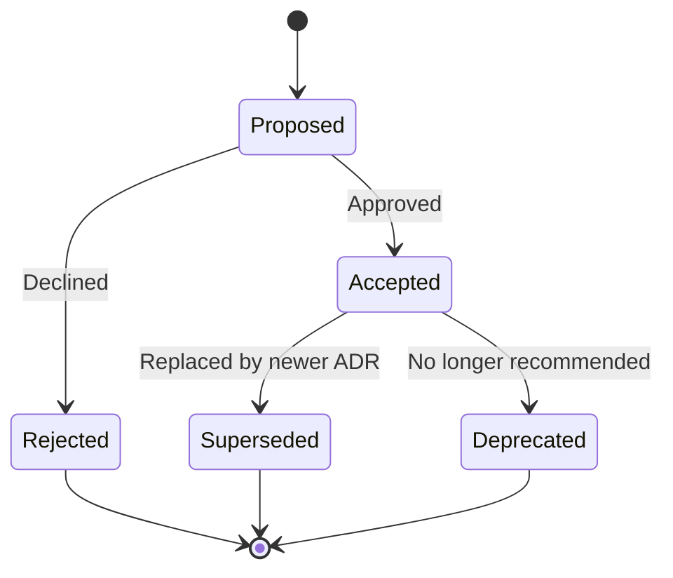

# Architecture Decision Records (ADR)

This directory contains Architectural Decision Records documenting significant design choices made in the AI DIAL RAG Overview project.

## What is an ADR?

An Architecture Decision Record captures a significant architectural decision along with its context, rationale, and consequences. ADRs help teams understand:
- **Why** certain design choices were made
- **What** alternatives were considered
- **When** the decision was made
- **Who** was involved
- **What** the trade-offs are

## ADR Format

Each ADR follows this structure:
```markdown
# Title

## Status
[Accepted | Rejected | Superseded | Deprecated]

## Context
What is the issue we're addressing?

## Decision
What did we decide to do?

## Consequences
What are the trade-offs and implications?

## Alternatives Considered
What other options were evaluated?
```

## Decision Log

| ID | Title | Status | Date | Impact |
|----|-------|--------|------|--------|
| [ADR-001](./ADR-001-faiss-vector-storage.md) | FAISS for Vector Storage | Accepted | 2025-12-30 | High |
| [ADR-002](./ADR-002-environment-config.md) | Environment-Based Configuration | Accepted | 2025-12-30 | Medium |
| [ADR-003](./ADR-003-chunking-strategy.md) | Document Chunking Strategy | Accepted | 2025-12-30 | High |
| [ADR-004](./ADR-004-synchronous-pipeline.md) | Synchronous Pipeline Design | Accepted | 2025-12-30 | Medium |

### ADR Summaries

**ADR-001**: Why FAISS over Pinecone, Chroma, Elasticsearch, or others. Balances cost, simplicity, and educational value.

**ADR-002**: Why environment variables for configuration. Provides security while maintaining simplicity and portability.

**ADR-003**: Why character-based recursive splitting over semantic chunking, tokens, or manual sections. Best balance for the manual size and structure.

**ADR-004**: Why synchronous pipeline over async, parallel, or queue-based approaches. Prioritizes clarity for educational context.

## How to Propose a New ADR

1. Copy the ADR template: `ADR-000-template.md`
2. Rename with next sequential number: `ADR-005-your-title.md`
3. Fill in all sections with thorough analysis
4. Submit for review
5. Update this index upon acceptance

## ADR Lifecycle



## Related Documentation

- [Architecture Overview](../architecture.md) - High-level system design
- [API Reference](../api.md) - Implementation details
- [Roadmap](../roadmap.md) - Future decisions

---

**Maintained by**: EPAM AI/ML Team  
**Last Review**: 2025-12-30
