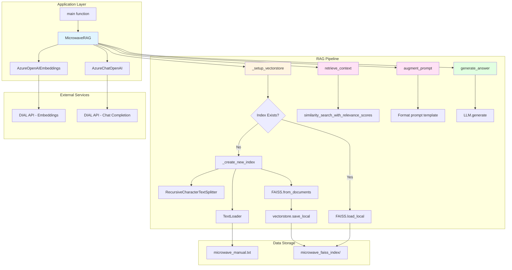
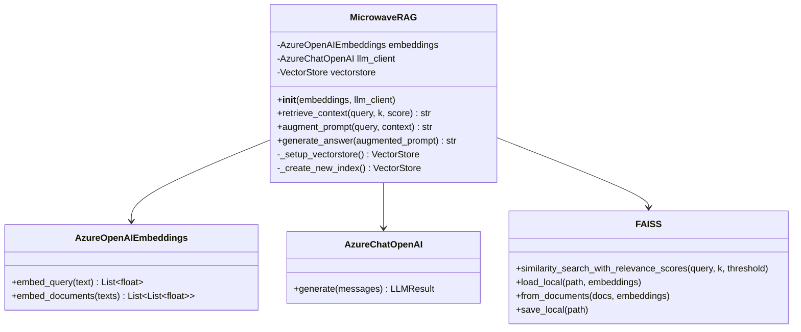
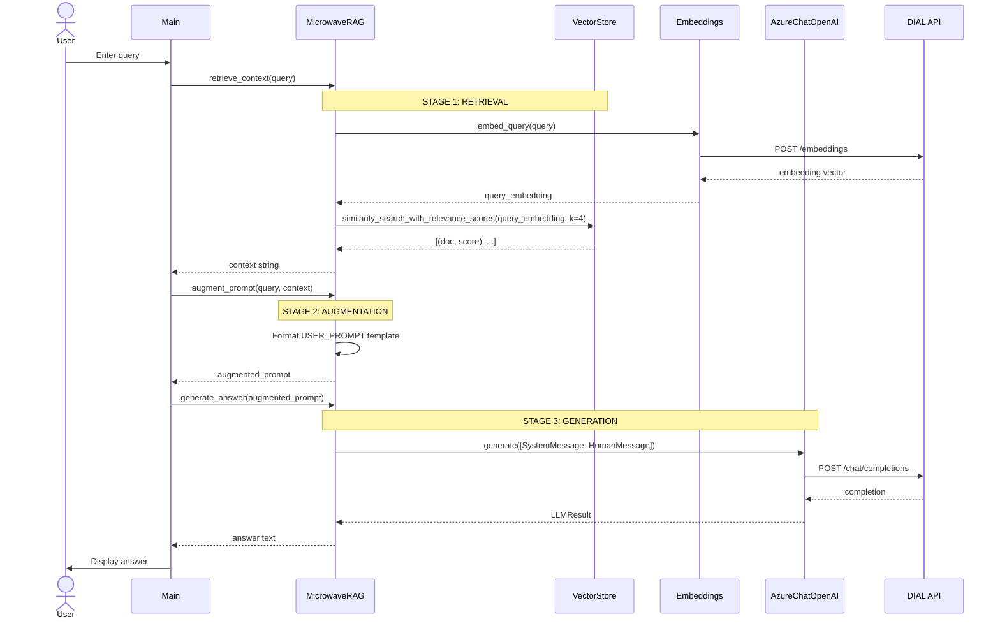
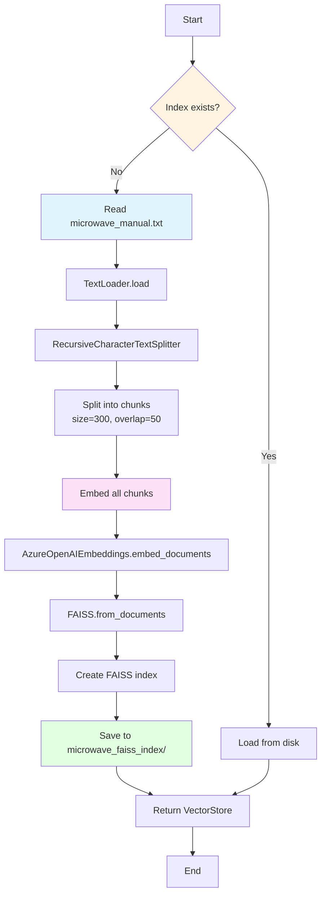

# Architecture Documentation

## Table of Contents
- [System Overview](#system-overview)
- [Component Architecture](#component-architecture)
- [Data Flow](#data-flow)
- [Module Breakdown](#module-breakdown)
- [Design Decisions](#design-decisions)
- [Integration Points](#integration-points)
- [Constraints & Trade-offs](#constraints--trade-offs)

## System Overview

The AI DIAL RAG Overview implements a classic three-stage RAG architecture for question-answering over a domain-specific knowledge base (microwave manual).

### Architecture Diagram



### System Characteristics

| Characteristic | Value |
|---------------|-------|
| **Architecture Pattern** | Pipeline (3-stage RAG) |
| **Deployment Model** | Single-process CLI application |
| **State Management** | Stateless (per-query), persistent vector index |
| **Concurrency** | Single-threaded, synchronous |
| **Scalability** | Vertical (constrained by FAISS in-memory index) |
| **Data Persistence** | Local filesystem (FAISS index) |

## Component Architecture

### 1. MicrowaveRAG Class

**Responsibility**: Orchestrates the complete RAG pipeline

**Dependencies**:
- `AzureOpenAIEmbeddings`: Converts text to vectors
- `AzureChatOpenAI`: Generates answers from prompts
- `FAISS`: Vector similarity search

**Key Methods**:



### 2. Configuration Module (`_constants.py`)

**Responsibility**: Centralized configuration management

```python
DIAL_URL: str          # DIAL API endpoint
API_KEY: str           # Authentication token (from env)
```

**Design Note**: Environment variable fallback pattern ensures secrets aren't committed. See [ADR-002: Environment-Based Configuration](./adr/ADR-002-environment-config.md).

### 3. Knowledge Base (`microwave_manual.txt`)

**Format**: Plain text (UTF-8)  
**Size**: ~497 lines, ~25KB  
**Structure**: Sections on safety, operation, cleaning, specifications

**Preprocessing**: None (loaded as-is, chunked by `RecursiveCharacterTextSplitter`)

### 4. Vector Index (`microwave_faiss_index/`)

**Format**: FAISS binary index  
**Location**: `./microwave_faiss_index/index.faiss`  
**Generation**: Lazy (created on first run if missing)  
**Persistence**: Local filesystem

**Index Properties**:
- **Embedding Model**: `text-embedding-3-small-1` (Azure OpenAI)
- **Dimensionality**: 1536 (determined by embedding model)
- **Distance Metric**: L2 (Euclidean) [FAISS default]

## Data Flow

### End-to-End Query Flow



### Vector Index Creation Flow



## Module Breakdown

### `task/app.py`

**Lines of Code**: 173  
**Entry Point**: `main()` function (line 151)  
**Key Classes**: `MicrowaveRAG`

**Module Responsibilities**:
- RAG pipeline orchestration
- Vector store initialization and persistence
- Document chunking and embedding
- Similarity search and context retrieval
- Prompt augmentation
- LLM answer generation

**External Dependencies**:
- `langchain_community`: Document loaders, vector stores
- `langchain_text_splitters`: Text chunking
- `langchain_openai`: Azure OpenAI integrations
- `langchain_core`: Message types, abstractions

### `task/_constants.py`

**Lines of Code**: 4  
**Exports**: `DIAL_URL`, `API_KEY`

**Module Responsibilities**:
- Centralized configuration
- Environment variable management

### `task/microwave_manual.txt`

**Data File**: Knowledge base  
**Format**: UTF-8 plaintext  
**Content**: Microwave model DW 395 HCG manual

## Design Decisions

### Why FAISS for Vector Storage?

**Decision**: Use FAISS for local vector similarity search  
**Rationale**:
- Educational focus: Students learn vector indexing locally
- No external database dependencies
- Fast similarity search (<10ms for 4 results)
- Persistent index avoids re-embedding on every run

**Trade-offs**:
- Not horizontally scalable
- In-memory constraint (~1GB for large knowledge bases)
- No multi-user support

See [ADR-001: FAISS for Vector Storage](./adr/ADR-001-faiss-vector-storage.md)

### Why RecursiveCharacterTextSplitter?

**Decision**: Use `RecursiveCharacterTextSplitter` with separators `["\n\n", "\n", "."]`  
**Parameters**: `chunk_size=300`, `chunk_overlap=50`

**Rationale**:
- Preserves semantic coherence (splits on paragraphs, then sentences)
- `chunk_size=300` balances context vs. specificity
- `chunk_overlap=50` prevents context loss at boundaries

**Trade-offs**:
- May split mid-sentence if paragraph > 300 chars
- Overlap increases storage by ~17%

See [ADR-003: Document Chunking Strategy](./adr/ADR-003-chunking-strategy.md)

### Why Three Separate Methods?

**Decision**: `retrieve_context`, `augment_prompt`, `generate_answer` as separate methods

**Rationale**:
- Educational clarity: Students see each RAG stage explicitly
- Debugging: Inspect intermediate outputs
- Flexibility: Tune each stage independently

**Trade-offs**:
- More verbose than a single `query()` method
- Requires manual orchestration in `main()`

## Integration Points

### 1. DIAL API Integration

**Service**: EPAM's AI Proxy for Azure OpenAI  
**Endpoint**: `https://ai-proxy.lab.epam.com`  
**Authentication**: Bearer token (`DIAL_API_KEY`)

**Used For**:
- Text embeddings (`text-embedding-3-small-1`)
- Chat completions (`gpt-4o`)

**Network Requirements**:
- EPAM VPN connection required
- HTTPS (TLS 1.2+)

**Error Handling**: TODO: Currently none. See [Roadmap](./roadmap.md) for planned improvements.

### 2. Filesystem Integration

**Index Persistence**:
- **Path**: `./microwave_faiss_index/`
- **Format**: Binary FAISS index + pickle metadata
- **Safety**: `allow_dangerous_deserialization=True` (trusted source)

**Knowledge Base**:
- **Path**: `task/microwave_manual.txt` (relative to script location)
- **Encoding**: UTF-8
- **Error Handling**: Raises `FileNotFoundError` if missing

## Constraints & Trade-offs

### Performance Constraints

| Operation | Latency | Bottleneck |
|-----------|---------|------------|
| Index creation | ~30s | DIAL API embeddings |
| Query embedding | ~200ms | DIAL API network |
| Similarity search | <10ms | FAISS in-memory |
| LLM generation | ~2-5s | DIAL API (Azure OpenAI) |

**Total Query Time**: ~2.5-5.5s (dominated by LLM generation)

### Scalability Constraints

- **Single-threaded**: No concurrent query support
- **In-memory index**: Limited by RAM (~1GB for 10K chunks)
- **Local storage**: No distributed deployment

### Cost Constraints

**DIAL API Usage**:
- Embeddings: ~$0.0001 per 1K tokens
- Chat completions: ~$0.03 per 1K tokens (GPT-4o)

**Estimated Cost per Query**:
- Retrieval: ~$0.0001 (400 tokens embedded)
- Generation: ~$0.003 (100 tokens avg response)
- **Total**: ~$0.0031 per query

### Security Constraints

- **API Key**: Stored in environment variable (not version-controlled)
- **Network**: Requires EPAM VPN (internal proxy)
- **Data**: Knowledge base is public (microwave manual)

**Known Vulnerabilities**:
- `allow_dangerous_deserialization=True` in FAISS loading (acceptable for trusted local index)

## Open Questions

- **Monitoring**: How to instrument for production? (metrics, logging, tracing)
- **Error handling**: Should failures retry? Circuit breaker pattern?
- **Multi-tenancy**: How to support multiple users or knowledge bases?
- **Performance**: Can we batch queries or use async I/O?

See [Roadmap](./roadmap.md) for planned explorations.

---

**Related Documentation**:
- [API Reference](./api.md) - Detailed method signatures
- [ADR Index](./adr/README.md) - Architectural decision records
- [Testing Guide](./testing.md) - Validation strategies
