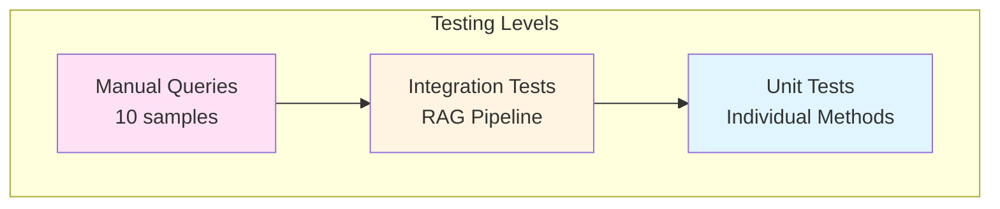

# Testing Guide

## Table of Contents
- [Testing Strategy](#testing-strategy)
- [Valid Test Queries](#valid-test-queries)
- [Invalid Test Queries](#invalid-test-queries)
- [Validation Criteria](#validation-criteria)
- [Manual Testing](#manual-testing)
- [Automated Testing](#automated-testing)

## Testing Strategy

### Test Pyramid



**Current State**: Manual testing with sample queries  
**Future State**: Automated integration tests (see [Roadmap](./roadmap.md))

### Test Dimensions

| Dimension | Coverage |
|-----------|----------|
| **Query Complexity** | Simple facts, multi-step procedures, specifications |
| **Context Relevance** | Direct matches, partial matches, no matches |
| **Safety Constraints** | In-domain vs out-of-domain queries |
| **Answer Quality** | Accuracy, completeness, source grounding |

---

## Valid Test Queries

These queries should return accurate, grounded answers from the microwave manual.

### Category: Safety Precautions

#### Query 1: Exposure to Microwave Energy

```
What safety precautions should be taken to avoid exposure to excessive microwave energy?
```

**Expected Context**: Section on door safety, interlocks, sealing surfaces

**Expected Answer Elements**:
- Do not operate with door open
- Do not tamper with safety interlocks
- Do not allow soil on sealing surfaces
- Ensure door closes properly

**Validation**:
```python
context = rag.retrieve_context(query, k=4, score=0.3)
assert "door open" in context.lower()
assert "safety interlock" in context.lower() or "interlock" in context.lower()
```

---

#### Query 2: Plastic/Paper Container Safety

```
What should you do if food in plastic or paper containers starts smoking during heating?
```

**Expected Context**: Fire safety section

**Expected Answer Elements**:
- Switch off or unplug appliance
- Keep door closed to stiffle flames
- Monitor containers due to ignition risk

**Validation Criteria**: Answer mentions "switch off" or "unplug" AND "door closed"

---

### Category: Operation & Usage

#### Query 3: Maximum Cooking Time

```
What is the maximum cooking time that can be set on the DW 395 HCG microwave oven?
```

**Expected Context**: Specifications or operation section

**Expected Answer**: Specific time limit (e.g., 99 minutes 99 seconds)

**Retrieval Score**: Should be high (>0.7) due to specific model number match

---

#### Query 4: Clock Setting

```
What are the steps to set the clock time on the DW 395 HCG microwave oven?
```

**Expected Context**: Operation instructions, control panel section

**Expected Answer Elements**:
- Step-by-step procedure
- Button sequences
- Display indicators

**Validation**: Answer contains numbered steps or sequential instructions

---

#### Query 5: ECO Function

```
What is the ECO function on this microwave and how do you activate it?
```

**Expected Context**: Feature descriptions, energy-saving mode

**Expected Answer Elements**:
- ECO function purpose
- Activation steps
- Expected behavior

---

#### Query 6: Multi-Stage Cooking

```
How does the multi-stage cooking feature work, and what types of cooking programs cannot be included in it?
```

**Expected Context**: Advanced features, cooking modes

**Expected Answer Elements**:
- Multi-stage cooking definition
- How to program multiple stages
- Restrictions/limitations

**Complexity**: High (requires combining information from multiple chunks)

---

### Category: Maintenance & Cleaning

#### Query 7: Glass Tray Cleaning

```
How should you clean the glass tray of the microwave oven?
```

**Expected Context**: Cleaning and maintenance section

**Expected Answer Elements**:
- Cleaning method (mild soap, warm water)
- What to avoid (abrasive cleaners, harsh chemicals)

---

#### Query 8: Odor Removal

```
What is the recommended procedure for removing odors from the microwave oven?
```

**Expected Context**: Maintenance section

**Expected Answer**: Specific procedure (e.g., boil lemon water, wipe down)

---

### Category: Specifications & Installation

#### Query 9: Installation Requirements

```
What are the specifications for proper installation, including the required free space around the oven?
```

**Expected Context**: Installation section, specifications

**Expected Answer Elements**:
- Clearance measurements (top, sides, back)
- Ventilation requirements
- Surface requirements

**Validation**: Answer contains specific measurements (cm or inches)

---

#### Query 10: Safe Materials

```
What materials are safe to use in this microwave during both microwave and grill cooking modes?
```

**Expected Context**: Utensil safety, materials guide

**Expected Answer Elements**:
- Safe materials list (glass, ceramic, microwave-safe plastic)
- Unsafe materials (metal, foil, certain plastics)
- Mode-specific considerations

---

## Invalid Test Queries

These queries fall **outside the knowledge base** and should trigger the "cannot answer" response.

### Out-of-Domain Queries

#### Query 11: Unrelated Domain

```
What do you know about the DIALX community?
```

**Expected Behavior**:
- Low retrieval scores (<0.3)
- Answer: "I cannot answer this question based on the available context."
- Should NOT hallucinate information about DIALX

**Validation**:
```python
context = rag.retrieve_context(query, k=4, score=0.3)
assert len(context) == 0 or "microwave" in context.lower()

answer = rag.generate_answer(augmented_prompt)
assert "cannot answer" in answer.lower() or "not available" in answer.lower()
```

---

#### Query 12: Historical/General Knowledge

```
What do you think about the dinosaur era? Why did they die?
```

**Expected Behavior**:
- No relevant context retrieved
- Answer: Polite decline ("I can only answer questions about microwave usage")

**Validation**: Answer does NOT contain dinosaur facts from LLM's training data

---

### Edge Cases

#### Query 13: Empty Query

```

```

**Expected Behavior**: Handle gracefully (prompt for input or return error)

---

#### Query 14: Very Long Query

```
<1000+ word query>
```

**Expected Behavior**: Process normally (embeddings handle long text)

---

#### Query 15: Non-English Query

```
¿Cómo limpio el microondas?
```

**Expected Behavior**: Likely no relevant context (knowledge base is English)

**Future Enhancement**: Multilingual embeddings (see [Roadmap](./roadmap.md))

---

## Validation Criteria

### Retrieval Quality

| Metric | Threshold | Measurement |
|--------|-----------|-------------|
| **Relevance Score** | >0.5 for primary chunk | Manual inspection |
| **Context Length** | 200-1500 chars | `len(context)` |
| **Chunk Count** | 2-4 chunks | `len(context.split('\n\n'))` |
| **Latency** | <500ms | Time `retrieve_context()` |

**Validation Script**:
```python
import time

start = time.time()
context = rag.retrieve_context(query, k=4, score=0.3)
latency = time.time() - start

print(f"Latency: {latency:.3f}s")
print(f"Context length: {len(context)} chars")
print(f"Chunks: {len(context.split('\\n\\n'))}")
```

---

### Answer Quality

| Criterion | Pass Condition |
|-----------|---------------|
| **Grounding** | Statements traceable to context |
| **Accuracy** | Facts match manual content |
| **Completeness** | Answers all parts of query |
| **Conciseness** | No excessive fluff (100-300 words) |
| **Safety** | No out-of-domain hallucinations |

**Manual Validation Checklist**:
- [ ] Answer addresses the question
- [ ] All facts present in retrieved context
- [ ] No contradictions with manual
- [ ] Appropriate disclaimers if context insufficient
- [ ] No fabricated details

---

### Pipeline Integrity

```python
def test_pipeline_integrity(rag, query):
    """Validate complete RAG pipeline"""
    
    # Stage 1: Retrieval
    context = rag.retrieve_context(query, k=4, score=0.3)
    assert isinstance(context, str), "Context must be string"
    
    # Stage 2: Augmentation
    augmented_prompt = rag.augment_prompt(query, context)
    assert query in augmented_prompt, "Query must be in prompt"
    assert context in augmented_prompt, "Context must be in prompt"
    
    # Stage 3: Generation
    answer = rag.generate_answer(augmented_prompt)
    assert isinstance(answer, str), "Answer must be string"
    assert len(answer) > 0, "Answer must not be empty"
    
    print("✓ Pipeline integrity validated")
```

---

## Manual Testing

### Interactive Testing Session

```bash
python -m task.app
```

**Test Procedure**:
1. Run application
2. Input each valid query (1-10)
3. Review output for:
   - Retrieval: Relevant chunks, good scores
   - Augmentation: Proper prompt structure
   - Generation: Accurate, grounded answer
4. Input each invalid query (11-12)
5. Verify graceful handling (no hallucination)

**Checklist**:
```
[ ] Query 1: Safety precautions - Accurate answer
[ ] Query 2: Smoking containers - Mentions "switch off"
[ ] Query 3: Max cooking time - Specific time value
[ ] Query 4: Clock setting - Step-by-step instructions
[ ] Query 5: ECO function - Clear explanation
[ ] Query 6: Multi-stage cooking - Explains feature + limits
[ ] Query 7: Glass tray cleaning - Cleaning method described
[ ] Query 8: Odor removal - Specific procedure given
[ ] Query 9: Installation specs - Includes measurements
[ ] Query 10: Safe materials - Lists safe/unsafe materials
[ ] Query 11: DIALX - Declines to answer
[ ] Query 12: Dinosaurs - Declines to answer
```

---

### Context Inspection

```python
# Manually inspect retrieved context
query = "What safety precautions should be taken?"
context = rag.retrieve_context(query, k=4, score=0.3)

print("=== RETRIEVED CONTEXT ===")
chunks = context.split('\n\n')
for i, chunk in enumerate(chunks, 1):
    print(f"\n--- Chunk {i} ---")
    print(chunk[:200] + "..." if len(chunk) > 200 else chunk)
```

**Look for**:
- Relevant content in all chunks
- No duplicate chunks
- Logical ordering (highest score first)

---

## Automated Testing

### Unit Tests (Future)

```python
import unittest

class TestMicrowaveRAG(unittest.TestCase):
    
    @classmethod
    def setUpClass(cls):
        cls.rag = MicrowaveRAG(embeddings, llm)
    
    def test_retrieve_context_returns_string(self):
        context = self.rag.retrieve_context("test query")
        self.assertIsInstance(context, str)
    
    def test_retrieve_context_filters_by_score(self):
        # High threshold should return fewer chunks
        context_strict = self.rag.retrieve_context("safety", k=4, score=0.8)
        context_permissive = self.rag.retrieve_context("safety", k=4, score=0.2)
        
        self.assertLessEqual(
            len(context_strict.split('\n\n')),
            len(context_permissive.split('\n\n'))
        )
    
    def test_augment_prompt_includes_query_and_context(self):
        query = "test query"
        context = "test context"
        prompt = self.rag.augment_prompt(query, context)
        
        self.assertIn(query, prompt)
        self.assertIn(context, prompt)
    
    def test_invalid_query_handling(self):
        context = self.rag.retrieve_context("dinosaurs", k=4, score=0.3)
        # Should return empty or low-relevance context
        self.assertTrue(len(context) == 0 or "microwave" not in context.lower())

if __name__ == '__main__':
    unittest.main()
```

---

### Integration Tests (Future)

```python
def test_end_to_end_valid_query():
    """Test complete RAG pipeline with valid query"""
    rag = MicrowaveRAG(embeddings, llm)
    
    query = "What safety precautions should be taken to avoid exposure to excessive microwave energy?"
    
    # Execute pipeline
    context = rag.retrieve_context(query, k=4, score=0.3)
    augmented_prompt = rag.augment_prompt(query, context)
    answer = rag.generate_answer(augmented_prompt)
    
    # Assertions
    assert len(context) > 0, "Should retrieve context"
    assert "door" in context.lower(), "Should mention door safety"
    assert len(answer) > 50, "Answer should be substantial"
    assert any(keyword in answer.lower() for keyword in ["door", "interlock", "safety"]), \
        "Answer should address safety concerns"
    
    print(f"✓ Valid query test passed")

def test_end_to_end_invalid_query():
    """Test complete RAG pipeline with out-of-domain query"""
    rag = MicrowaveRAG(embeddings, llm)
    
    query = "What do you know about the DIALX community?"
    
    # Execute pipeline
    context = rag.retrieve_context(query, k=4, score=0.3)
    
    if len(context) > 0:
        augmented_prompt = rag.augment_prompt(query, context)
        answer = rag.generate_answer(augmented_prompt)
        
        # Answer should decline gracefully
        assert any(keyword in answer.lower() for keyword in ["cannot", "unable", "don't have"]), \
            "Should decline out-of-domain query"
    
    print(f"✓ Invalid query test passed")
```

---

### Regression Test Suite (Future)

**Test Matrix**:

| Test ID | Query Type | Expected Retrieval | Expected Answer |
|---------|------------|-------------------|-----------------|
| T001 | Safety | High relevance (>0.7) | Grounded, specific |
| T002 | Operation | Medium relevance (>0.5) | Step-by-step |
| T003 | Specification | High relevance (>0.7) | Numeric details |
| T004 | Out-of-domain | Low relevance (<0.3) | Declines gracefully |

**Execution**:
```bash
# TODO: Implement test runner
python -m pytest tests/test_rag.py -v
```

---

## Performance Testing

### Latency Benchmarks

```python
import time

def benchmark_query(rag, query, iterations=5):
    """Measure average query latency"""
    
    times = {
        'retrieval': [],
        'augmentation': [],
        'generation': []
    }
    
    for _ in range(iterations):
        # Retrieval
        start = time.time()
        context = rag.retrieve_context(query)
        times['retrieval'].append(time.time() - start)
        
        # Augmentation
        start = time.time()
        prompt = rag.augment_prompt(query, context)
        times['augmentation'].append(time.time() - start)
        
        # Generation
        start = time.time()
        answer = rag.generate_answer(prompt)
        times['generation'].append(time.time() - start)
    
    # Report averages
    print(f"\n{'Stage':<15} {'Avg (ms)':<10} {'Std Dev':<10}")
    print("-" * 35)
    for stage, measurements in times.items():
        avg = sum(measurements) / len(measurements) * 1000
        std = (sum((x - avg/1000)**2 for x in measurements) / len(measurements))**0.5 * 1000
        print(f"{stage.capitalize():<15} {avg:<10.1f} {std:<10.1f}")

# Run benchmark
benchmark_query(rag, "What safety precautions should be taken?")
```

**Expected Output**:
```
Stage           Avg (ms)   Std Dev   
-----------------------------------
Retrieval       210.5      15.2      
Augmentation    0.8        0.1       
Generation      3245.7     425.3     
```

---

**Related Documentation**:
- [API Reference](./api.md) - Method signatures for testing
- [Architecture](./architecture.md) - Understanding pipeline for validation
- [Setup Guide](./setup.md) - Environment setup for testing
