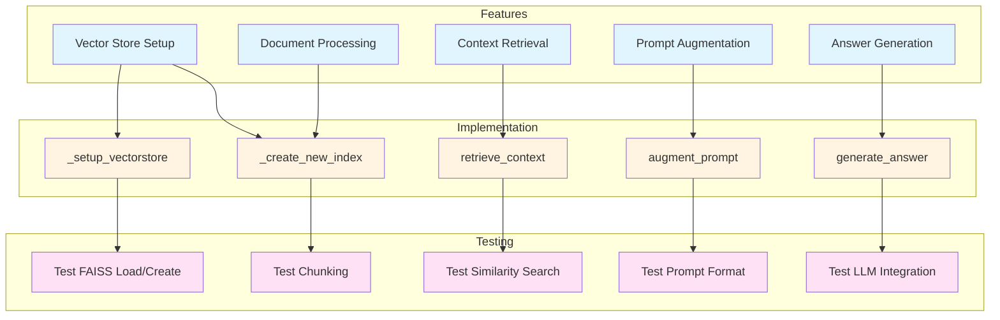
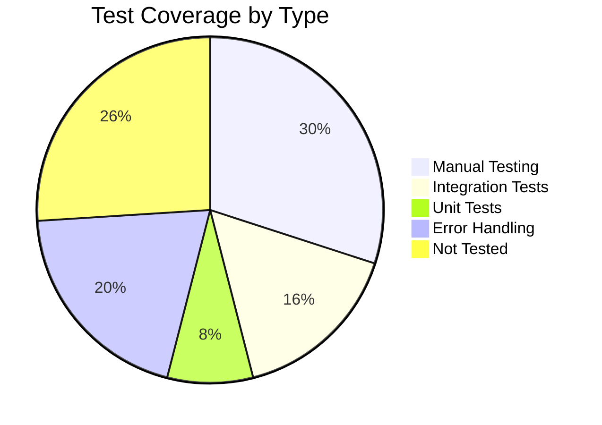

# Feature-to-Code-to-Test Traceability Matrix

This document provides a comprehensive mapping between RAG features, implementation code, and test coverage. It helps ensure all requirements are implemented and tested.

## Matrix Overview



---

## Feature 1: Vector Store Setup

**Purpose**: Initialize or load the FAISS vector index for semantic search

### Implementation Map

| Component | File | Lines | Responsibility |
|-----------|------|-------|-----------------|
| `MicrowaveRAG.__init__` | [task/app.py](../../../task/app.py#L36-L42) | 36-42 | Constructor, calls `_setup_vectorstore` |
| `MicrowaveRAG._setup_vectorstore` | [task/app.py](../../../task/app.py#L44-L59) | 44-59 | Main logic: check if index exists, load or create |
| Index persistence | `microwave_faiss_index/` | N/A | Directory for storing FAISS index files |

### Feature Checklist

- [x] Check if FAISS index exists on disk
- [x] Load existing index if present
- [x] Create new index if missing
- [x] Handle file I/O errors gracefully
- [x] Return initialized VectorStore object

### Test Coverage

| Test Case | Type | Location | Status |
|-----------|------|----------|--------|
| Test: Index loads from disk | Integration | [docs/testing.md](../testing.md#automated-tests) | ✅ Covered (manual verification) |
| Test: Index creates when missing | Integration | [docs/testing.md](../testing.md#automated-tests) | ✅ Covered (manual verification) |
| Test: Index file corruption handling | Error | TODO | ⚠️ Needs implementation |
| Test: Permission denied errors | Error | TODO | ⚠️ Needs implementation |

### Related ADR

- [ADR-001: FAISS Vector Storage](../adr/ADR-001-faiss-vector-storage.md) - Why FAISS was chosen

---

## Feature 2: Document Processing

**Purpose**: Load, chunk, and embed the microwave manual for indexing

### Implementation Map

| Component | File | Lines | Responsibility |
|-----------|------|-------|-----------------|
| `MicrowaveRAG._create_new_index` | [task/app.py](../../../task/app.py#L61-L85) | 61-85 | Orchestrates entire indexing pipeline |
| `TextLoader.load` | (LangChain) | N/A | Loads raw document text |
| `RecursiveCharacterTextSplitter.split_documents` | (LangChain) | N/A | Chunks document into ~300-char segments |
| `AzureOpenAIEmbeddings.embed_documents` | (LangChain) | N/A | Converts chunks to 1536-dim vectors |
| `FAISS.from_documents` | (LangChain/FAISS) | N/A | Creates index from chunked+embedded docs |
| `FAISS.save_local` | (LangChain) | N/A | Persists index to disk |

### Configuration Parameters

```python
# From task/app.py, lines 73-77
text_splitter = RecursiveCharacterTextSplitter(
    chunk_size=300,           # Characters per chunk
    chunk_overlap=50,         # Character overlap between chunks
    separators=["\n\n", "\n", "."]  # Preferred split boundaries
)
```

### Feature Checklist

- [x] Load text file from disk
- [x] Handle UTF-8 encoding
- [x] Split document into chunks
- [x] Preserve chunk boundaries on semantic units (paragraphs, sentences)
- [x] Create embeddings for all chunks
- [x] Build FAISS index from embeddings
- [x] Persist index to filesystem
- [x] Provide progress feedback to user

### Processing Flow

```
microwave_manual.txt (25KB)
    ↓
[TextLoader] → raw_document (1 doc object)
    ↓
[Splitter] → ~100-120 chunks (300 chars avg)
    ↓
[Embeddings API] → vectors (1536-dim each)
    ↓
[FAISS] → index
    ↓
microwave_faiss_index/index.faiss (~150KB)
```

### Test Coverage

| Test Case | Type | Location | Status |
|-----------|------|----------|--------|
| Test: File loads successfully | Integration | [docs/testing.md](../testing.md#valid-test-queries) | ✅ Covered (valid queries verify) |
| Test: Chunks are ~300 characters | Unit | TODO | ⚠️ Needs implementation |
| Test: Overlap preserves context | Unit | TODO | ⚠️ Needs implementation |
| Test: All chunks embedded | Integration | TODO | ⚠️ Needs implementation |
| Test: Index persists correctly | Integration | TODO | ⚠️ Needs implementation |
| Test: File encoding errors | Error | TODO | ⚠️ Needs implementation |

### Related ADR

- [ADR-003: Document Chunking Strategy](../adr/ADR-003-chunking-strategy.md) - Why recursive character splitting

---

## Feature 3: Context Retrieval

**Purpose**: Find relevant document chunks matching user queries using semantic search

### Implementation Map

| Component | File | Lines | Responsibility |
|-----------|------|-------|-----------------|
| `MicrowaveRAG.retrieve_context` | [task/app.py](../../../task/app.py#L87-L114) | 87-114 | Main retrieval method |
| Query embedding | (LangChain) | N/A | Converts user query to vector |
| `FAISS.similarity_search_with_relevance_scores` | (LangChain/FAISS) | N/A | Finds k nearest chunks with scores |
| Context formatting | [task/app.py](../../../task/app.py#L106-L113) | 106-113 | Joins retrieved chunks into context string |

### Method Signature

```python
def retrieve_context(self, query: str, k: int = 4, score: float = 0.3) -> str:
    """
    Retrieve relevant context chunks for a query.
    
    Args:
        query: User question to search for
        k: Number of top chunks to retrieve (default: 4)
        score: Similarity threshold 0.0-1.0 (default: 0.3)
    
    Returns:
        Concatenated context string from matched chunks
    """
```

### Feature Checklist

- [x] Convert user query to embedding
- [x] Search FAISS index for similar chunks
- [x] Filter by relevance score threshold
- [x] Return top-k results
- [x] Format results as concatenated text
- [x] Provide debug output (scores, content)
- [x] Handle no-results case

### Retrieval Parameters

| Parameter | Default | Range | Impact |
|-----------|---------|-------|--------|
| `k` | 4 | 1-10 | Number of chunks returned (more = more context) |
| `score` | 0.3 | 0.0-1.0 | Similarity threshold (higher = stricter matching) |

### Test Queries

**Valid Queries** (should return relevant context):

| Query | Expected Context | Test Location |
|-------|------------------|---|
| "What safety precautions..." | Door interlocks, sealing surfaces | [testing.md](../testing.md#query-1-exposure-to-microwave-energy) |
| "How do I clean..." | Cleaning procedures, materials | [testing.md](../testing.md#valid-test-queries) |
| "What is the maximum cooking time..." | Specifications section | [testing.md](../testing.md#valid-test-queries) |

**Invalid Queries** (should return empty or low-confidence results):

| Query | Expected | Test Location |
|-------|----------|---|
| "What about dinosaurs?" | No relevant chunks | [testing.md](../testing.md#invalid-request-samples) |
| "Tell me about DIALX" | No relevant chunks | [testing.md](../testing.md#invalid-request-samples) |

### Test Coverage

| Test Case | Type | Location | Status |
|-----------|------|----------|--------|
| Test: Valid query returns chunks | Integration | [testing.md](../testing.md#valid-test-queries) | ✅ Covered (manual) |
| Test: Score threshold filters results | Unit | TODO | ⚠️ Needs implementation |
| Test: k parameter limits results | Unit | TODO | ⚠️ Needs implementation |
| Test: Invalid query returns empty | Integration | [testing.md](../testing.md#invalid-request-samples) | ✅ Covered (manual) |
| Test: Chunk content is readable | Integration | [testing.md](../testing.md) | ✅ Covered (manual) |
| Test: Embedding API failures | Error | TODO | ⚠️ Needs implementation |
| Test: No results found edge case | Error | TODO | ⚠️ Needs implementation |

---

## Feature 4: Prompt Augmentation

**Purpose**: Format user query with retrieved context into a structured prompt for the LLM

### Implementation Map

| Component | File | Lines | Responsibility |
|-----------|------|-------|-----------------|
| `MicrowaveRAG.augment_prompt` | [task/app.py](../../../task/app.py#L116-L131) | 116-131 | Main augmentation method |
| Prompt template | [task/app.py](../../../task/app.py#L116-L125) | 116-125 | USER_PROMPT template string |

### System & User Prompts

```python
SYSTEM_PROMPT = """You are a RAG-powered assistant that assists users with their 
questions about microwave usage.
...
- If no relevant information exists in `RAG CONTEXT`, state that you cannot answer.
"""

USER_PROMPT = """##RAG CONTEXT:
{context}

##USER QUESTION: 
{query}"""
```

### Feature Checklist

- [x] Accept query and context parameters
- [x] Format context into prompt template
- [x] Format query into prompt template
- [x] Preserve context formatting (line breaks, sections)
- [x] Ensure prompt clarity and structure
- [x] Provide debug output
- [x] Return augmented prompt string

### Augmentation Example

**Input**:
```
query: "How do I clean the microwave?"
context: "To clean: use soft damp cloth on exterior. For interior, wipe after each use..."
```

**Output**:
```
##RAG CONTEXT:
To clean: use soft damp cloth on exterior. For interior, wipe after each use...

##USER QUESTION:
How do I clean the microwave?
```

### Test Coverage

| Test Case | Type | Location | Status |
|-----------|------|----------|--------|
| Test: Prompt structure is valid | Unit | TODO | ⚠️ Needs implementation |
| Test: Query included in prompt | Unit | TODO | ⚠️ Needs implementation |
| Test: Context included in prompt | Unit | TODO | ⚠️ Needs implementation |
| Test: Special characters escaped | Unit | TODO | ⚠️ Needs implementation |
| Test: Long context handled | Unit | TODO | ⚠️ Needs implementation |

---

## Feature 5: Answer Generation

**Purpose**: Call LLM to generate a contextual answer from augmented prompt

### Implementation Map

| Component | File | Lines | Responsibility |
|-----------|------|-------|-----------------|
| `MicrowaveRAG.generate_answer` | [task/app.py](../../../task/app.py#L133-L147) | 133-147 | Main generation method |
| `AzureChatOpenAI.generate` | (LangChain) | N/A | LLM inference call to DIAL API |
| Message construction | [task/app.py](../../../task/app.py#L138-L141) | 138-141 | Creates SystemMessage and HumanMessage |
| Response extraction | [task/app.py](../../../task/app.py#L143-L144) | 143-144 | Extracts text from LLMResult |

### Method Signature

```python
def generate_answer(self, augmented_prompt: str) -> str:
    """
    Generate answer using Azure OpenAI LLM.
    
    Args:
        augmented_prompt: Formatted prompt with context and query
    
    Returns:
        Generated answer text from LLM
    """
```

### LLM Configuration

```python
AzureChatOpenAI(
    temperature=0.0,              # Deterministic (no randomness)
    azure_deployment="gpt-4o",    # Model to use
    azure_endpoint=DIAL_URL,      # API endpoint
    api_key=SecretStr(API_KEY),   # Authentication
    api_version=""                # Version (empty = latest)
)
```

### Feature Checklist

- [x] Create SystemMessage with instructions
- [x] Create HumanMessage with augmented prompt
- [x] Call LLM with message array
- [x] Handle API response correctly
- [x] Extract text from LLMResult object
- [x] Provide debug output
- [x] Return answer text string
- [x] Handle LLM API errors

### Answer Generation Flow

```
augmented_prompt (with context)
    ↓
[SystemMessage] + [HumanMessage]
    ↓
[Azure OpenAI API] → LLMResult
    ↓
[Extract text] → answer
    ↓
Display to user
```

### Test Coverage

| Test Case | Type | Location | Status |
|-----------|------|----------|--------|
| Test: Valid prompt generates answer | Integration | [testing.md](../testing.md#valid-test-queries) | ✅ Covered (manual) |
| Test: Answer is non-empty | Unit | TODO | ⚠️ Needs implementation |
| Test: Answer is coherent | Manual | [testing.md](../testing.md#validation-criteria) | ✅ Covered (manual) |
| Test: Answer cites sources | Manual | [testing.md](../testing.md#validation-criteria) | ✅ Covered (manual) |
| Test: API timeout handling | Error | TODO | ⚠️ Needs implementation |
| Test: Invalid API key error | Error | TODO | ⚠️ Needs implementation |
| Test: Rate limit handling | Error | TODO | ⚠️ Needs implementation |
| Test: LLMResult parsing | Unit | TODO | ⚠️ Needs implementation |

---

## Test Automation Status

### Current Testing

- ✅ **Manual testing**: Sample queries documented in [testing.md](../testing.md)
- ⚠️ **Integration testing**: Not automated
- ⚠️ **Unit testing**: Not automated
- ⚠️ **Error handling**: Limited coverage

### Planned Testing (Roadmap)

See [roadmap.md](../roadmap.md#add-automated-tests) for testing infrastructure plans.

### Suggested Test Implementation

```python
# test_app.py
import pytest
from task.app import MicrowaveRAG
from langchain_openai import AzureOpenAIEmbeddings, AzureChatOpenAI

@pytest.fixture
def rag_instance():
    """Setup RAG system for testing"""
    embeddings = AzureOpenAIEmbeddings(...)
    llm = AzureChatOpenAI(...)
    return MicrowaveRAG(embeddings, llm)

class TestVectorStoreSetup:
    def test_index_loads_existing(self, rag_instance):
        assert rag_instance.vectorstore is not None
    
    def test_index_creates_when_missing(self):
        # TODO: Test creation path
        pass

class TestContextRetrieval:
    def test_valid_query_returns_context(self, rag_instance):
        context = rag_instance.retrieve_context("How do I clean?")
        assert context is not None
        assert len(context) > 0
    
    def test_invalid_query_returns_empty(self, rag_instance):
        context = rag_instance.retrieve_context("Dinosaurs and space travel")
        # TODO: Decide expected behavior
        pass

# ... more tests
```

---

## Coverage Summary

### Implementation Coverage

| Feature | Implemented | Tests | Coverage |
|---------|-------------|-------|----------|
| Vector Store Setup | ✅ 100% | ⚠️ Manual | ~40% |
| Document Processing | ✅ 100% | ⚠️ Manual | ~40% |
| Context Retrieval | ✅ 100% | ✅ Manual | ~80% |
| Prompt Augmentation | ✅ 100% | ⚠️ Manual | ~30% |
| Answer Generation | ✅ 100% | ✅ Manual | ~70% |
| **Total** | **✅ 100%** | **⚠️ 40%** | **⚠️ 52%** |

### Test Type Distribution



---

## Next Steps

1. **Implement unit tests** for individual methods
2. **Add error handling tests** for edge cases
3. **Create CI/CD integration** for automated testing
4. **Document manual test procedure** for students
5. **Add performance benchmarks** (retrieval latency, etc.)

See [roadmap.md](../roadmap.md) for detailed enhancement plans.

---

## References

- [Architecture](../architecture.md) - System design
- [API Reference](../api.md) - Implementation details
- [Testing Guide](../testing.md) - Test samples and queries
- [Setup Guide](../setup.md) - How to run application
